# MCP Platform - Model Context Protocol Implementation

Une plateforme complète implémentant le Model Context Protocol (MCP) avec un frontend moderne Angular, des services backend Spring Boot et un serveur MCP Python.

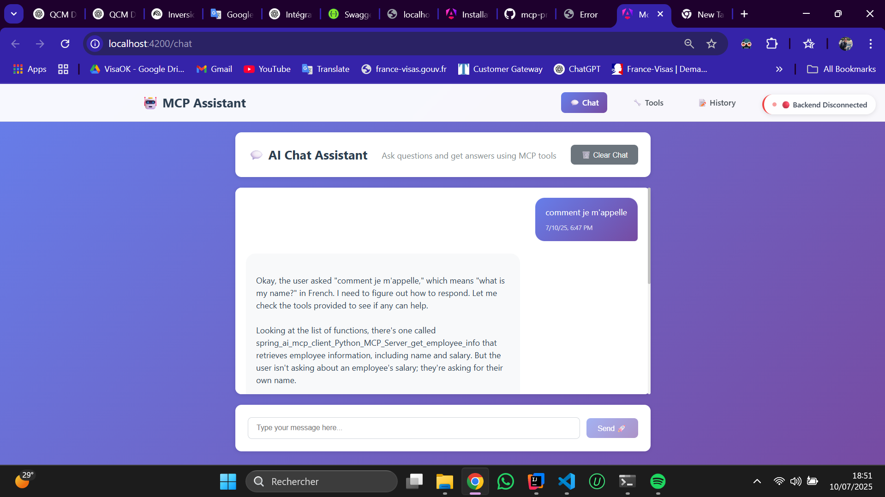

## 📑 Table des Matières

- [Vue d'ensemble](#vue-densemble)
- [Architecture](#architecture)
- [Composants du Projet](#composants-du-projet)
- [Installation et Configuration](#installation-et-configuration)
- [Utilisation](#utilisation)
- [Screenshots](#screenshots)
- [API Documentation](#api-documentation)
- [Technologies Utilisées](#technologies-utilisées)
- [Développement](#développement)
- [Contribution](#contribution)

## 🎯 Vue d'ensemble

Cette plateforme MCP offre une interface complète pour interagir avec des modèles d'IA via le Model Context Protocol. Le projet comprend :

- **Frontend Angular moderne** : Interface utilisateur responsive avec thèmes clair/sombre
- **Backend Spring Boot** : API REST et client MCP
- **Serveur MCP Python** : Serveur MCP avec outils personnalisés
- **Intégration Ollama** : Support pour les modèles locaux

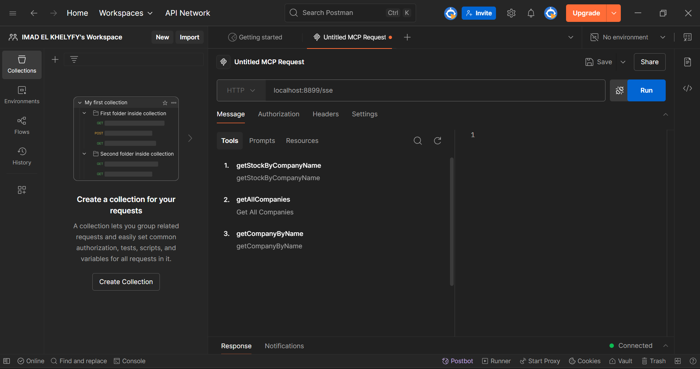

## 🏗 Architecture

```
mcp-tp/
├── mcp-frontend/          # Frontend Angular 20
├── mcp-client/            # Client Spring Boot
├── mcp-server/            # Serveur Spring Boot  
├── python-mpc-server/     # Serveur MCP Python
└── screnne/              # Screenshots et documentation
```

## 🚀 Composants du Projet

### 1. MCP Frontend (Angular 20)

Interface utilisateur moderne et responsive avec :

- **Design System** : Thèmes clair/sombre avec CSS Variables
- **Composants Modulaires** : Header, Chat, Tools, History
- **Responsive Design** : Optimisé mobile et desktop
- **Animations Fluides** : Transitions et effets modernes
- **TypeScript** : Typage strict et interfaces

**Fonctionnalités principales :**
- Chat interactif avec l'IA
- Gestion des outils MCP
- Historique des conversations
- Statut de connexion en temps réel
- Basculement de thème intuitif

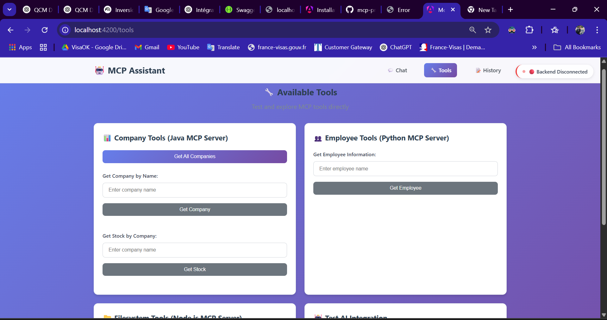

### 2. MCP Client (Spring Boot)

Service backend principal avec :

- **API REST** : Endpoints pour le frontend
- **Client MCP** : Intégration avec les serveurs MCP
- **Gestion des Sessions** : Maintien des conversations
- **Proxy Intelligent** : Routage des requêtes

**Endpoints principaux :**
```
GET  /chat?query={message}    # Chat avec l'IA
GET  /tools                   # Liste des outils disponibles
POST /mcp/companies          # Gestion des entreprises
GET  /mcp/stock              # Informations boursières
```


### 3. MCP Server (Spring Boot)

Serveur MCP Java avec outils spécialisés :

- **Outils Financiers** : Données boursières et entreprises
- **API REST** : Services exposés via HTTP
- **Model Context Protocol** : Implémentation complète

**Outils disponibles :**
- `get_company_info` : Informations d'entreprise
- `get_stock_price` : Prix des actions
- `list_companies` : Liste des entreprises

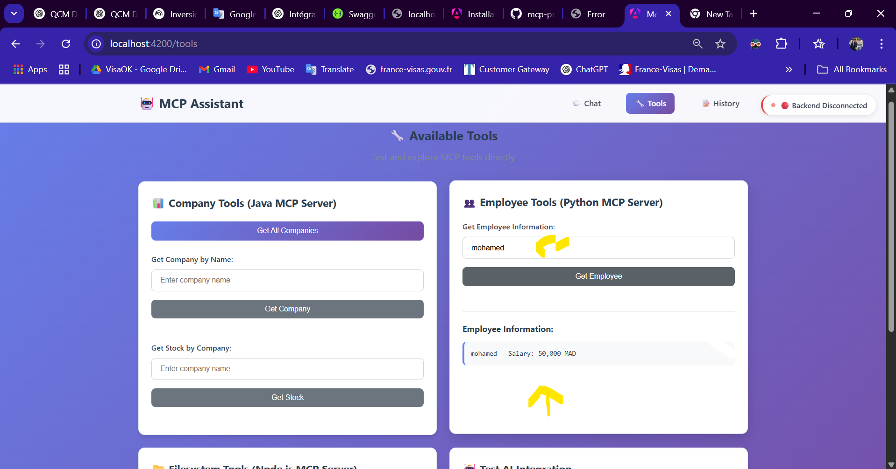

### 4. Python MCP Server

Serveur MCP Python avec fonctionnalités étendues :

- **Gestion des Employés** : Informations RH
- **Intégration Python** : Outils flexibles
- **API REST** : Endpoints spécialisés


## ⚙️ Installation et Configuration

### Prérequis

- **Node.js** 18+ et npm
- **Java** 21+
- **Maven** 3.8+
- **Python** 3.13+
- **Ollama** (optionnel, pour modèles locaux)

### 1. Installation du Frontend

```bash
cd mcp-frontend
npm install
npm run dev    # Développement sur http://localhost:4200
npm run build  # Build de production
```

### 2. Installation du Backend Java

```bash
# MCP Client
cd mcp-client
mvn clean install
mvn spring-boot:run    # Port 8080

# MCP Server
cd mcp-server
mvn clean install
mvn spring-boot:run    # Port 8081
```

### 3. Installation du Serveur Python

```bash
cd python-mpc-server
pip install -r requirements.txt
python server.py       # Port configuré
```

### 4. Configuration Ollama (Optionnel)

```bash
# Installation d'Ollama
curl -fsSL https://ollama.ai/install.sh | sh

# Téléchargement d'un modèle
ollama pull llama2
ollama serve           # Port 11434
```


## 🎮 Utilisation

### Interface Chat

1. **Démarrage** : Accédez à `http://localhost:4200`
2. **Chat** : Tapez vos messages dans l'interface
3. **Outils** : Les outils MCP sont automatiquement disponibles
4. **Thème** : Basculez entre mode clair/sombre

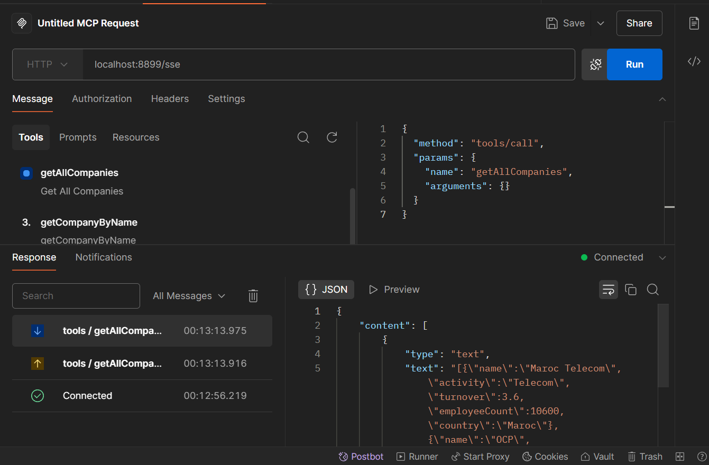

### Utilisation des Outils

Les outils MCP sont intégrés dans le chat :

```
Utilisateur: "Donne-moi des infos sur Apple"
IA: [Utilise get_company_info("Apple")]
Réponse: Informations détaillées sur Apple Inc.
```

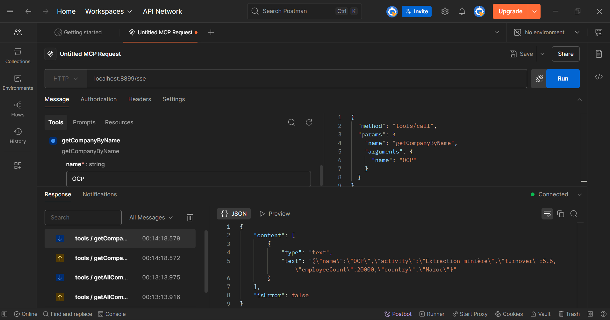

### API Rest

Testez directement les endpoints :

```bash
# Chat
curl "http://localhost:8080/chat?query=Hello"

# Outils
curl "http://localhost:8080/tools"

# Entreprises
curl "http://localhost:8080/mcp/companies"
```

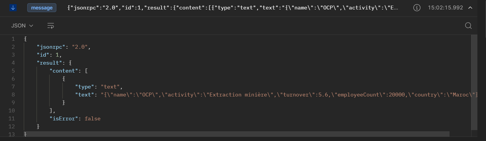

## 📸 Screenshots

### Interface Principale
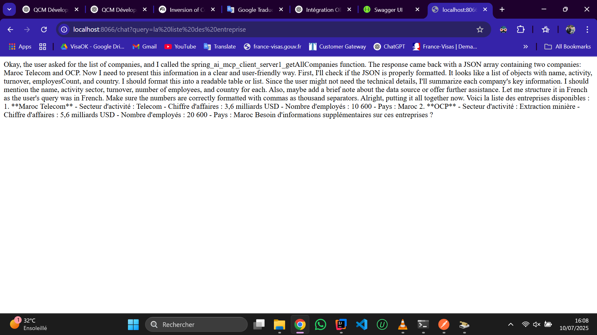

### Gestion des Outils
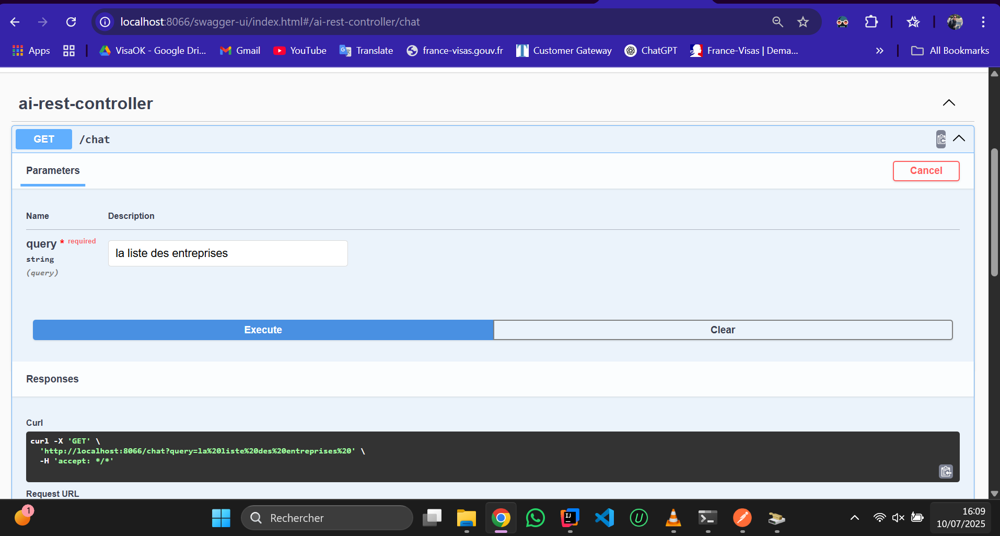

### Informations Employés
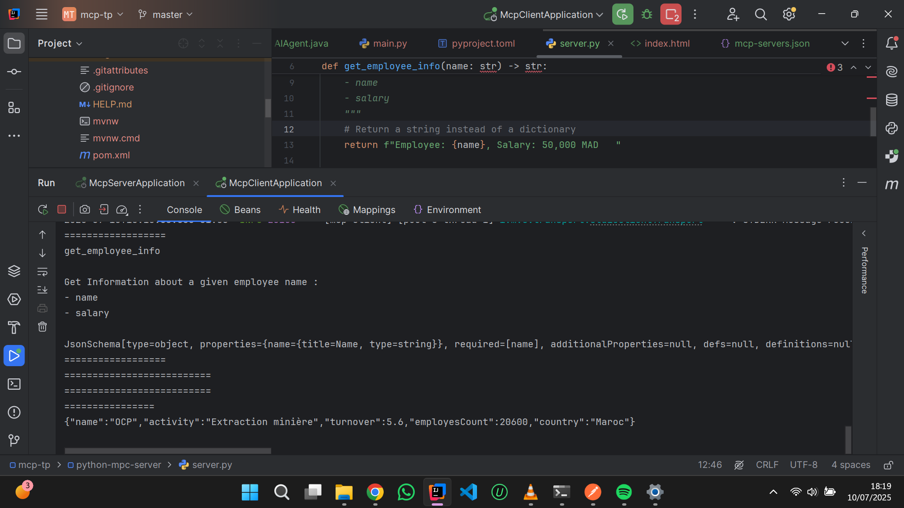

### Historique des Conversations
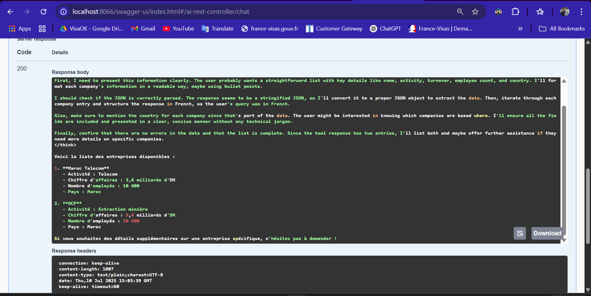

### Mode Sombre
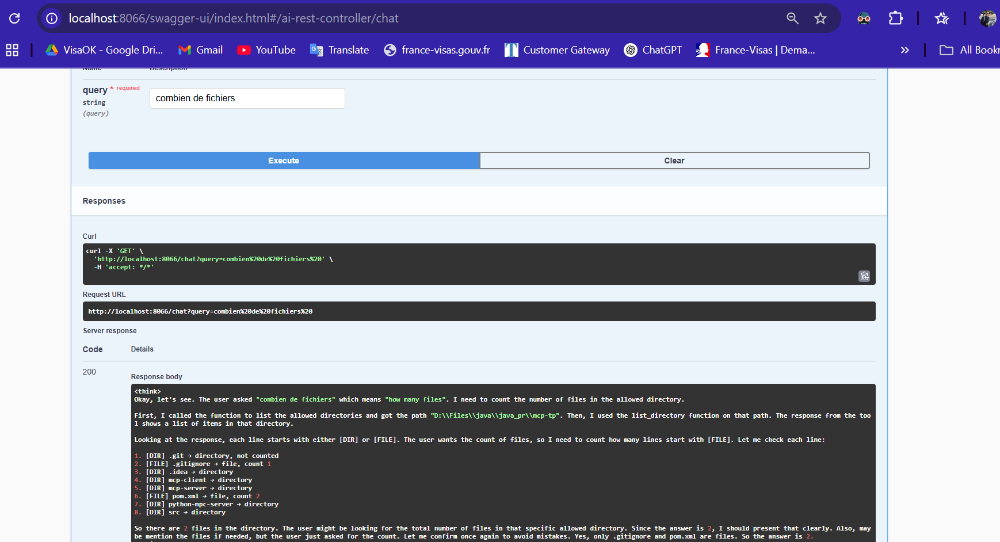

## 📚 API Documentation

### Endpoints Frontend

| Endpoint | Méthode | Description |
|----------|---------|-------------|
| `/chat` | GET | Interface de chat |
| `/tools` | GET | Liste des outils |
| `/history` | GET | Historique des conversations |

### Endpoints Backend

| Endpoint | Méthode | Description | Paramètres |
|----------|---------|-------------|------------|
| `/chat` | GET | Chat avec IA | `query` (string) |
| `/tools` | GET | Outils disponibles | - |
| `/mcp/companies` | GET | Liste entreprises | - |
| `/mcp/company` | GET | Info entreprise | `name` (string) |
| `/mcp/stock` | GET | Prix action | `name` (string) |
| `/python/employee` | GET | Info employé | `name` (string) |

### Modèles de Données

```typescript
interface ChatMessage {
  id: string;
  content: string;
  sender: 'user' | 'assistant';
  timestamp: Date;
  tools?: McpTool[];
}

interface McpTool {
  name: string;
  description: string;
  parameters: any;
}

interface Company {
  name: string;
  sector: string;
  founded: number;
  headquarters: string;
}
```

## 🛠 Technologies Utilisées

### Frontend
- **Angular 20** - Framework principal
- **TypeScript** - Typage statique
- **CSS Variables** - Système de design
- **RxJS** - Programmation réactive
- **Angular Router** - Navigation
- **Angular SSR** - Server-Side Rendering

### Backend
- **Spring Boot 3.5** - Framework Java
- **Spring Web** - API REST
- **Spring WebFlux** - Programmation réactive
- **Maven** - Gestion des dépendances
- **Java 21** - Langage principal

### MCP Python
- **Python 3.13** - Langage principal
- **MCP SDK** - Kit de développement MCP
- **FastAPI** - Framework web (optionnel)
- **Pydantic** - Validation des données

### Infrastructure
- **Ollama** - Modèles IA locaux
- **Docker** - Conteneurisation (prévu)
- **Git** - Contrôle de version

## 👨‍💻 Développement

### Structure du Frontend

```
mcp-frontend/src/
├── app/
│   ├── components/          # Composants UI
│   │   ├── header/         # En-tête avec navigation
│   │   ├── chat/           # Interface de chat
│   │   ├── tools/          # Gestion des outils
│   │   ├── history/        # Historique
│   │   └── connection-status/ # Statut connexion
│   ├── services/           # Services Angular
│   │   ├── api.service.ts  # Communication API
│   │   └── theme.service.ts # Gestion des thèmes
│   ├── models/             # Interfaces TypeScript
│   └── app.routes.ts       # Configuration des routes
├── styles.css              # Styles globaux
└── environments/           # Configuration
```

### Commandes de Développement

```bash
# Frontend
npm run dev          # Serveur de développement
npm run build:dev    # Build développement
npm run build:prod   # Build production
npm run test         # Tests unitaires

# Backend
mvn clean compile    # Compilation
mvn spring-boot:run  # Serveur de développement
mvn test            # Tests unitaires
mvn package         # Package JAR

# Python
python server.py     # Serveur MCP
python -m pytest    # Tests (si configuré)
```

### Standards de Code

- **ESLint/Prettier** - Formatage automatique
- **TypeScript Strict** - Mode strict activé
- **Conventional Commits** - Messages de commit standardisés
- **Component-First** - Architecture orientée composants

## 🤝 Contribution

1. **Fork** le projet
2. **Créez** une branche feature (`git checkout -b feature/amazing-feature`)
3. **Committez** vos changements (`git commit -m 'Add amazing feature'`)
4. **Push** vers la branche (`git push origin feature/amazing-feature`)
5. **Ouvrez** une Pull Request

### Guidelines

- Suivez les conventions de code existantes
- Ajoutez des tests pour les nouvelles fonctionnalités
- Mettez à jour la documentation si nécessaire
- Testez sur différents navigateurs/environnements

## 📝 License

Ce projet est sous licence MIT. Voir le fichier `LICENSE` pour plus de détails.

## 🆘 Support

Pour toute question ou problème :

1. Consultez la documentation
2. Vérifiez les issues existantes
3. Créez une nouvelle issue avec un maximum de détails
4. Joignez les logs et screenshots si nécessaire

---

## 👨‍💻 Développeur

**Développé par Imad EL KHELYFY**

📧 **Email** : imadelkhelyfy@gmail.com  
🎓 **Institution** : Faculté des Sciences Meknès  
📚 **Filière** : Sciences des Données et IA  
📖 **Module** : Systèmes Distribués  

> 🚀 **Version actuelle** : 1.0.0  
> 📅 **Dernière mise à jour** : Juillet 2025  
> 🌟 **Status** : En développement actif
